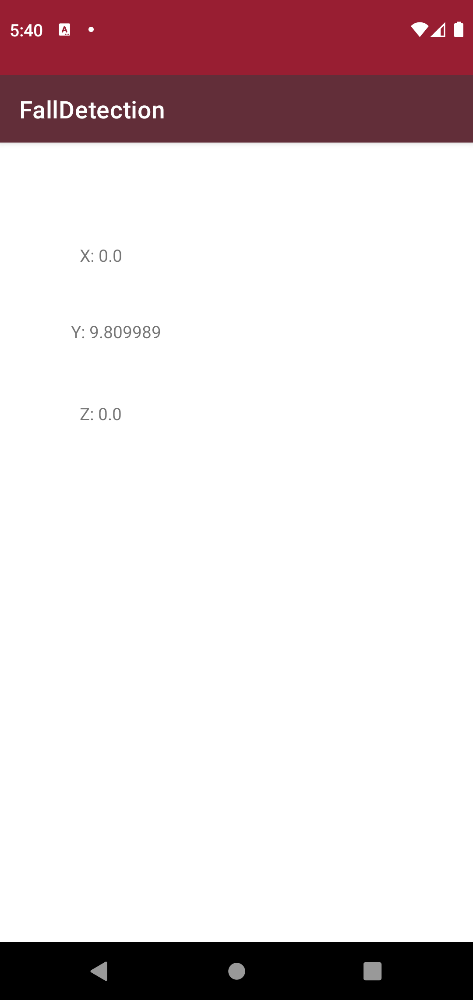

# FallDetector
CIS 4360 - Smart Sensing and Devices  
Fall 2022  
Matthew O'Mara

When the app starts the cordinates of the accelerometer will be displayed. When A fall is detected the user will be notified with a toast message.

#App scrreen

#App after a fall is detected

